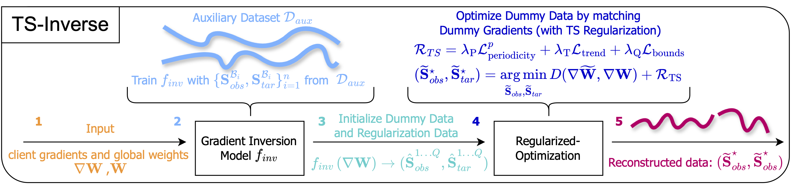

# TS-Inverse: A Gradient Inversion Attack Tailored for Federated Time Series Forecasting Models

[](https://arxiv.org/abs/2503.20952)
[![CC BY-SA 4.0][cc-by-sa-shield]][cc-by-sa]
<!-- [](https://arxiv.org/abs/2503.20952) -->

This repository contains the code and data that was created during the research.


## Abstract:

Federated learning (FL) for time series forecasting (TSF) enables clients with privacy-sensitive time series (TS) data to collaboratively learn accurate forecasting models, for example, in energy load prediction. Unfortunately, privacy risks in FL persist, as servers can potentially reconstruct clients' training data through gradient inversion attacks (GIA). Although GIA is demonstrated for image classification tasks, little is known about time series regression tasks. In this paper, we first conduct an extensive empirical study on inverting TS data across 4 TSF models and 4 datasets, identifying the unique challenges of reconstructing both observations and targets of TS data. We then propose TS-Inverse, a novel GIA that improves the inversion of TS data by (i) learning a gradient inversion model that outputs quantile predictions, (ii) a unique loss function that incorporates periodicity and trend regularization, and (iii) regularization according to the quantile predictions. Our evaluations demonstrate a remarkable performance of TS-Inverse, achieving at least a 2x-10x improvement in terms of the sMAPE metric over existing GIA methods on TS data. Code repository: https://github.com/Capsar/ts-inverse

## TS-Inverse Steps:


## Installation and Setup

Git clone the repository and enter the directory:

```bash
git clone git@github.com:Capsar/ts-inverse.git && cd ts-inverse
```

### Conda Environment

1. Follow the quick install guide for Miniconda: [Miniconda Installation Guide](https://docs.anaconda.com/free/miniconda/).
2. Create the environment:
    ```bash
    conda env create --name ts-inverse python=3.11
    ```
3. Activate the environment and install the ts-inverse package:
    ```bash
      conda activate ts-inverse
    ```
    Then run:
    ```bash
      pip install -e .
    ```

### UV

1. Run uv sync:

    ```bash
    uv sync
    ```

2. Install the package in the uv environment:
    ```bash
    uv pip install -e .
    ```

### Data Preparation

1. **Data Folder**: This folder should contain all datasets. Download the datasets by using the [`00_download_datasets.ipynb`](data/00_download_datasets.ipynb)  file.
2. **Data Processing**: Use the Jupyter notebook [`01_process_datasets.ipynb`](data/01_process_datasets.ipynb) to process the datasets into the correct structure for experiments. This notebook also includes code to plot the datasets and the time series.

### Directory Structure

- **[`data`](data)**: Contains all datasets.
- **[`notebooks`](notebooks)**: Contains all of the notebooks & experiments used for the research.
- **[`out`](out)**: Contains all plots created throughout the Jupyter notebooks.
- **[`src`](src)**: Contains all source code used in the experiments.
- **[`task_scripts`](task_scripts)**: Contains a script to create Jupyter Notebooks using `tmux` to run them in the background.

### Configuration

Create a `.env` file based on the `.env.template` file. Ensure to set the `WANDB_ENTITY` and `API_KEY` as they are crucial for storing experiments and retrieving data. Additionally, adjust the project names in the worker classes within the `src` folder as needed for your WANDB setup.

## Jupyter Notebook Structure

- **00_Notebooks**: Small experimental notebooks, some rely on code from the `src` folder.
- **01_Notebooks**: Focus on preparing and exploring datasets.
- **02_Notebooks**: Used for training forecasting models either centrally or using the Flwr framework.
- **04_Notebooks**: Baseline gradient inversion attack experiments.
- **05_Notebooks**: TS-Inverse experiments.
- **_wandb Notebooks**: Used to gather and plot all results from Weights and Biases.

Each experiment notebook follows a similar structure, which is explained in detail within the notebooks themselves.

## Usage

1. Ensure all datasets are downloaded and placed in the `data` folder.
2. Configure the environment variables in the `.env` file.
4. Follow the order of the notebooks (00, 01, 02, 04, 05) for conducting experiments.
5. Use the `_wandb` notebooks to gather and visualize experiment results.

## Additional Notes

- The `task_scripts` folder includes scripts to manage Jupyter Notebooks using `tmux`, allowing them to run in the background even when your laptop is closed.
- Ensure to update the WANDB project names in the worker classes.

## TODO:

In order to perform the attacks using the Flwr framekwork, the following steps need to be taken:
- Record the model parameters in  `src/server.py`, example is already provided.
- Use the stored model parameters to approximate the gradient updates and store these.
- Adjust the `train_model_and_record` function in `src/workers/attack_worker.py` such that it loads these model parameters and gradients into the appropriate variables.
- Start attacks using these variables.


# License:

This work is licensed under a
[Creative Commons Attribution-ShareAlike 4.0 International License][cc-by-sa].

[cc-by-sa]: http://creativecommons.org/licenses/by-sa/4.0/
[cc-by-sa-shield]: https://img.shields.io/badge/License-CC%20BY--SA%204.0-lightgrey.svg
